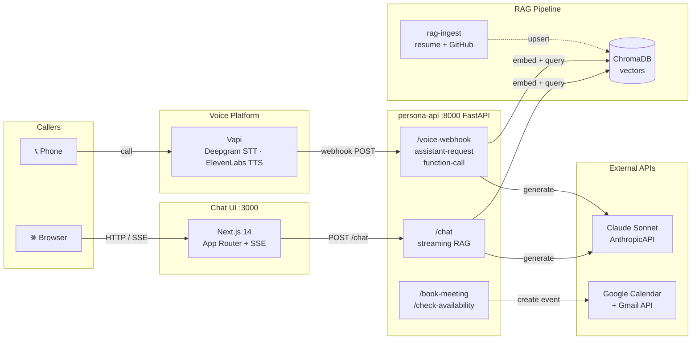

# ai-persona — Soumya

> A fully autonomous AI representative: answers questions about my background via voice or chat, grounded on my actual resume and GitHub, and books interviews directly into my Google Calendar.

[](https://www.python.org/) [](https://nextjs.org/) [](https://fastapi.tiangolo.com/) [](https://www.trychroma.com/) [](https://anthropic.com/)

---

## Architecture



> A static PNG version lives at `docs/architecture.png` — regenerate it with `python docs/create_diagram.py`.

---

## Quick Start

```bash
# 1. Configure secrets
cp .env .env          # fill in all API keys (see table below)

# 2. Index your data then start all services
docker-compose --profile tools run rag-ingest && docker-compose up -d

# 3. Provision the Vapi assistant + phone number
cd packages/voice && python setup_vapi.py   # prints VAPI_ASSISTANT_ID → add to .env
```

Open **http://localhost:3000** to chat, or call the provisioned number to use voice.

---

## Environment Variables

| Variable | Required | Description |
|---|:---:|---|
| `ANTHROPIC_API_KEY` | ✅ | LLM — claude-sonnet-4-20250514 |
| `OPENAI_API_KEY` | ✅ | Embeddings — text-embedding-3-small |
| `VAPI_API_KEY` | ✅ | Voice agent platform |
| `VAPI_ASSISTANT_ID` | after setup | Set after running `setup_vapi.py` |
| `VAPI_PHONE_NUMBER_ID` | after setup | Set after running `setup_vapi.py` |
| `ELEVENLABS_API_KEY` | ✅ | TTS voice — used by Vapi |
| `TWILIO_ACCOUNT_SID` | optional | Only needed for `setup_vapi.py --use-twilio` |
| `TWILIO_AUTH_TOKEN` | optional | Only needed for `setup_vapi.py --use-twilio` |
| `GOOGLE_CLIENT_ID` | ✅ | OAuth2 app credential for Calendar |
| `GOOGLE_CLIENT_SECRET` | ✅ | OAuth2 app credential for Calendar |
| `GOOGLE_CREDENTIALS_JSON` | ✅ | Full OAuth2 token JSON (run `calendar_service.py` once to generate) |
| `GOOGLE_CALENDAR_ID` | ✅ | Usually `primary` |
| `OWNER_EMAIL` | ✅ | Your Gmail address (sender for confirmations) |
| `GITHUB_TOKEN` | optional | Avoids GitHub API rate-limiting during ingest |
| `PERSONA_NAME` | ✅ | Your full name, e.g. `Soumya` |
| `RESUME_PATH` | ✅ | Path to your resume PDF, e.g. `./data/resume.pdf` |
| `CHROMA_PERSIST_DIR` | ✅ | `/app/chroma_db` inside Docker |
| `CHROMA_COLLECTION` | ✅ | `persona` |
| `PERSONA_API_URL` | ✅ | `http://persona-api:8000` (Docker network) |
| `NEXT_PUBLIC_PERSONA_API_URL` | ✅ | `http://localhost:8000` (browser) |
| `CALL_LOG_PATH` | optional | `/tmp/call_log.jsonl` — JSONL per-call log for evals |

See `.env` for the full annotated template.

---

## Cost Breakdown

| Component | Provider | Est. Cost |
|---|---|---|
| Voice (per min) | Vapi + ElevenLabs + Deepgram | ~$0.08/min |
| Chat (per session) | Claude Sonnet + ChromaDB | ~$0.002/msg |
| Calendar booking | Google API | Free |
| Embeddings (ingest) | OpenAI text-embedding-3-small | ~$0.0001/run |
| Hosting (persona-api) | Railway / Render | ~$7/mo |
| Hosting (chat-ui) | Vercel | Free tier |

> **Estimated total per 100 voice calls** (5 min avg): ~$40–55 · **Per 1 000 chat messages**: ~$2

---

## Eval Results

Run the eval suite first: `cd evals && pip install -r requirements.txt && python eval_chat.py`

| Metric | Value | Target |
|---|---|---|
| Chat accuracy | *(run evals)* | ≥ 85% |
| Hallucination rate | *(run evals)* | ≤ 10% |
| Refusal rate (adversarial) | *(run evals)* | ≥ 90% |
| Avg chat latency | *(run evals)* | ≤ 2 000 ms |
| RAG Precision@5 | *(run evals)* | ≥ 80% |
| Voice first-response latency | *(run evals)* | ≤ 2 s |
| Calendar booking success | *(run evals)* | 100% |

The 1-page PDF report is generated with `python evals/generate_eval_report.py` and saved to `evals/eval_report.pdf`.

---

## Project Structure

```
ai-persona/
├── packages/
│   ├── rag/                  # PyPDF2 + PyGithub → ChromaDB ingest pipeline
│   │   ├── loaders/          # resume.py, github.py
│   │   ├── embeddings.py     # OpenAI text-embedding-3-small, MD5 content IDs
│   │   ├── store.py          # ChromaDB upsert (cosine space)
│   │   ├── retriever.py      # query → top-k scored chunks
│   │   └── ingest.py         # CLI: python ingest.py [--reset]
│   ├── persona-api/          # FastAPI — chat, calendar, Vapi webhook
│   │   ├── routers/
│   │   │   ├── chat.py       # POST /chat  (streaming SSE + non-streaming)
│   │   │   ├── calendar.py   # POST /check-availability, POST /book-meeting
│   │   │   └── voice.py      # POST /voice-webhook  (delegates to voice_webhook.py)
│   │   ├── voice_webhook.py  # assistant-request RAG injection + function routing
│   │   ├── calendar_service.py  # Google Calendar + Gmail via OAuth2
│   │   ├── rag_client.py     # thin wrapper: query ChromaDB from API process
│   │   └── persona.py        # system prompt template
│   ├── chat-ui/              # Next.js 14 App Router
│   │   ├── app/
│   │   │   ├── api/          # /chat, /availability, /book proxy routes
│   │   │   └── page.tsx      # booking state machine + SSE streaming
│   │   ├── components/       # ChatBubble, SlotPicker, BookingForm, StarterChips
│   │   └── lib/              # sanitize.ts (prompt injection guard), types.ts
│   └── voice/
│       ├── vapi_config.json  # Vapi assistant spec (model, tools, voice)
│       └── setup_vapi.py     # create/update assistant + provision phone number
├── evals/
│   ├── golden_qa.json        # 20 Q&A pairs (5 resume, 5 GitHub, 5 behavioral, 3 adversarial, 2 unknown)
│   ├── eval_chat.py          # Claude-as-judge, hallucination/refusal/latency metrics
│   ├── eval_rag.py           # precision@5, MRR per golden question
│   ├── eval_voice_latency.py # Vapi test calls, first-response latency
│   └── generate_eval_report.py  # 1-page reportlab PDF
├── docs/
│   ├── create_diagram.py     # generates docs/architecture.png (requires graphviz)
│   └── architecture.png      # generated output
├── data/
│   └── resume.pdf            # YOUR resume — gitignored
├── chroma_db/                # vector store — gitignored
├── docker-compose.yml
└── .env
```

---

## Known Limitations

- **Cold-start latency**: First request after container start can spike above 2 s while ChromaDB initialises. Add a warm-up `curl` to the Docker `HEALTHCHECK` to mitigate.
- **Single-tenant ChromaDB**: The local ChromaDB instance doesn't scale horizontally; horizontal replicas would need a managed vector DB (Pinecone, Qdrant Cloud).
- **Google OAuth token expiry**: `GOOGLE_CREDENTIALS_JSON` contains a refresh token that needs to be re-generated if revoked. There is no automatic re-auth flow in the current deployment.
- **Vapi barge-in**: Barge-in is handled by Vapi's platform; the persona API has no additional barge-in logic. If Vapi's sensitivity is too low the assistant will talk over the caller.
- **GitHub rate limits**: Without a `GITHUB_TOKEN`, the ingest pipeline is limited to 60 API calls/hour, which is enough for ~10 repos.
- **Resume PDF format**: The section detector uses keyword heuristics; atypically formatted PDFs (tables, columns) may produce poor chunk quality. Switch to a structured JSON resume as input to fix this.

---

## Submission Checklist

- [ ] Resume PDF added to `data/resume.pdf`
- [ ] GitHub repos added to `packages/rag/config.yaml`
- [ ] All `.env` keys filled in
- [ ] `rag-ingest` run to completion
- [ ] Voice phone number live (from `setup_vapi.py`)
- [ ] Chat URL live (Vercel or Docker)
- [ ] Eval suite run → `eval_report.pdf` generated
- [ ] Public GitHub repo with this README
- [ ] Loom walkthrough recorded (≤ 4 min)
